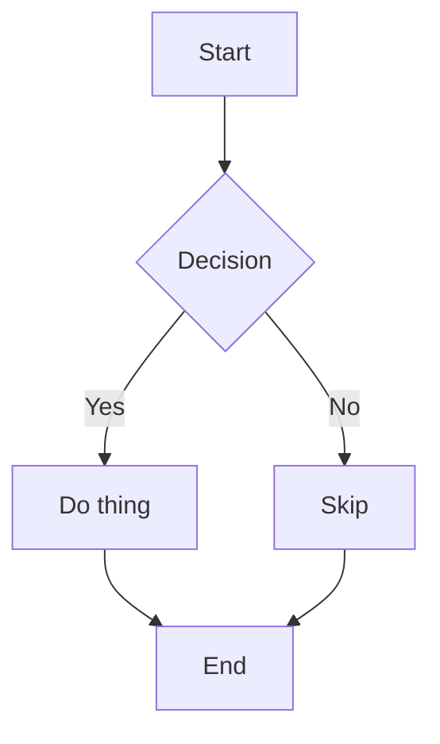
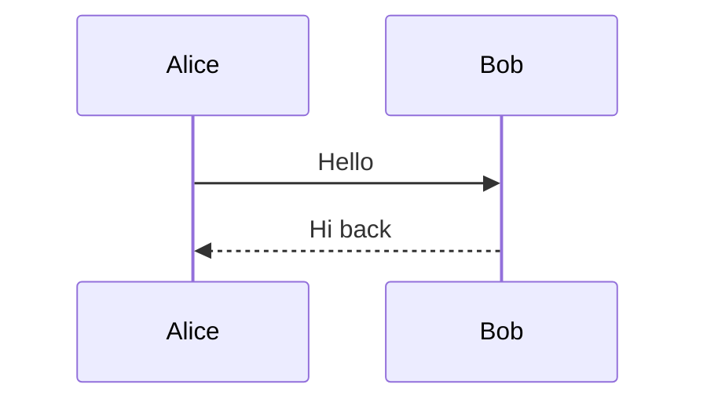

# Presenterm Advanced Features

Code execution, diagram rendering, speaker notes, transitions, and export.

## Table of Contents

1. [Code Execution](#code-execution)
2. [Diagram Rendering](#diagram-rendering)
3. [LaTeX and Math](#latex-and-math)
4. [Speaker Notes](#speaker-notes)
5. [Slide Transitions](#slide-transitions)
6. [Export](#export)
7. [Navigation Keys](#navigation-keys)

---

## Code Execution

Presenterm can run code snippets live during a presentation. The audience sees the code,
the presenter hits Ctrl+E, and the output appears below.

### Enabling

```bash
presenterm slides.md -x       # Enable +exec
presenterm slides.md -X       # Enable +exec_replace
```

Or in config:
```yaml
snippet:
  exec:
    enable: true
  exec_replace:
    enable: true
```

### Basic Execution

````markdown
```python +exec
print("Hello from the presentation!")
```
````

Press Ctrl+E to run. Output appears below the code block.

### Auto-Execute

````markdown
```python +auto_exec
import datetime
print(f"Rendered at {datetime.datetime.now()}")
```
````

Runs automatically when the slide loads.

### Execute and Replace

````markdown
```bash +exec_replace
date "+%Y-%m-%d %H:%M"
```
````

The code block is replaced by its output after execution.

### Pseudo-Terminal (PTY)

For interactive or TUI programs:

````markdown
```bash +exec +pty
htop
```
````

Custom PTY size:
````markdown
```bash +exec +pty:80:24
top -n 1
```
````

Standby mode (show PTY area before execution):
````markdown
```bash +exec +pty:standby:80:24
./my-tui-app
```
````

### Named Snippets and Output Placement

Place output in a different location than the code:

````markdown
```python +exec +id:calculation
result = 42 * 13
print(f"The answer is {result}")
```

Some explanatory text between code and output...

<!-- snippet_output: calculation -->
````

### Hidden Lines

Lines that execute but don't display — useful for imports and setup:

````markdown
```python +exec
/// import json
/// import sys
data = {"key": "value"}
print(json.dumps(data, indent=2))
```
````

Prefix depends on language:
- **Rust**: `# ` (hash space)
- **Python, Bash, Go, Java, JS, TS, etc.**: `/// ` (triple-slash space)

### Alternative Executors

````markdown
```rust +exec:rust-script
fn main() {
    println!("Using rust-script instead of cargo");
}
```
````

### Output as Image

````markdown
```bash +exec +image
cat chart.png
```
````

The command's stdout is interpreted as image data.

### Validation

Check that snippets compile without showing them as executable:

````markdown
```rust +validate
fn main() {
    let x: i32 = "hello"; // This would fail validation
}
```
````

Expect failure:
````markdown
```rust +validate +expect:failure
fn broken() { invalid syntax }
```
````

Validate all snippets in a file:
```bash
presenterm --validate-snippets slides.md
```

---

## Diagram Rendering

### Mermaid

Requires [mermaid-cli](https://github.com/mermaid-js/mermaid-cli) (`mmdc` command).

````markdown

````

Set width:
````markdown

````

Config:
```yaml
mermaid:
  scale: 2
  config_file: /path/to/mermaid-config.yml
```

Theme (in theme YAML):
```yaml
mermaid:
  background: transparent
  theme: dark
```

### D2 Diagrams

Requires [d2](https://d2lang.com/).

````markdown
```d2 +render
server: Web Server
db: Database {
  shape: cylinder
}
server -> db: queries
```
````

Config: `d2.scale: 2`

### Typst Diagrams

Requires `typst` CLI.

````markdown
```typst +render
#table(
  columns: 3,
  [Name], [Age], [City],
  [Alice], [30], [Paris],
)
```
````

### Auto-Render

Skip `+render` for specific languages:

```yaml
options:
  auto_render_languages:
    - mermaid
    - typst
```

---

## LaTeX and Math

**LaTeX** requires both `typst` and `pandoc`. **Typst** requires only `typst`.

### LaTeX

````markdown
```latex +render
\[ E = mc^2 \]
```
````

### Typst Math

````markdown
```typst +render
$ sum_(n=1)^infinity 2^(-n) = 1 $
```
````

Config:
```yaml
typst:
  ppi: 400    # Default 300
```

Theme colors:
```yaml
typst:
  colors:
    background: "000000"
    foreground: "ffffff"
  horizontal_margin: 2
  vertical_margin: 2
```

---

## Speaker Notes

### Adding Notes

```markdown
<!-- speaker_note: Brief note -->
```

Multi-line:
```markdown
<!--
speaker_note: |
  Detailed talking points:
  - Mention the migration timeline
  - Show the benchmark results
  - Ask for questions
-->
```

### Two-Terminal Setup

Terminal 1 (audience sees):
```bash
presenterm slides.md --publish-speaker-notes
```

Terminal 2 (presenter sees):
```bash
presenterm slides.md --listen-speaker-notes
```

### Config

```yaml
speaker_notes:
  always_publish: true
  listen_address: "127.0.0.1:59418"
  publish_address: "127.0.0.1:59418"
```

---

## Slide Transitions

Configured in `config.yaml`:

```yaml
transition:
  duration_millis: 750
  frames: 45
  animation:
    style: fade                   # fade | slide_horizontal | collapse_horizontal
```

---

## Export

### PDF Export

Requires [weasyprint](https://weasyprint.org/).

```bash
presenterm slides.md --export-pdf
presenterm slides.md --export-pdf --output my-talk.pdf
```

Config:
```yaml
export:
  dimensions:
    columns: 80
    rows: 30
  pauses: new_slide              # Pauses become new PDF pages
  pdf:
    fonts:
      normal: /path/to/font.ttf
      italic: /path/to/font-italic.ttf
      bold: /path/to/font-bold.ttf
      bold_italic: /path/to/font-bi.ttf
```

### HTML Export

```bash
presenterm slides.md --export-html
presenterm slides.md --export-html --output talk.html
```

Produces a self-contained HTML file.

### Snippet Handling During Export

```yaml
export:
  snippets: sequential           # Run snippets sequentially during export
```

---

## Navigation Keys

| Action | Keys |
|--------|------|
| Next slide | `l`, `j`, `Right`, `PageDown`, `Down`, `Space` |
| Previous slide | `h`, `k`, `Left`, `PageUp`, `Up` |
| Next (skip pauses) | `n` |
| Previous (skip pauses) | `p` |
| First slide | `gg` |
| Last slide | `G` |
| Go to slide N | `<N>G` |
| Execute code | `Ctrl+E` |
| Reload | `Ctrl+R` |
| Slide index | `Ctrl+P` |
| Key bindings help | `?` |
| Toggle visual grid | `T` |
| Skip pauses in slide | `s` |
| Close modal | `Esc` |
| Exit | `Ctrl+C`, `q` |
| Suspend | `Ctrl+Z` |
